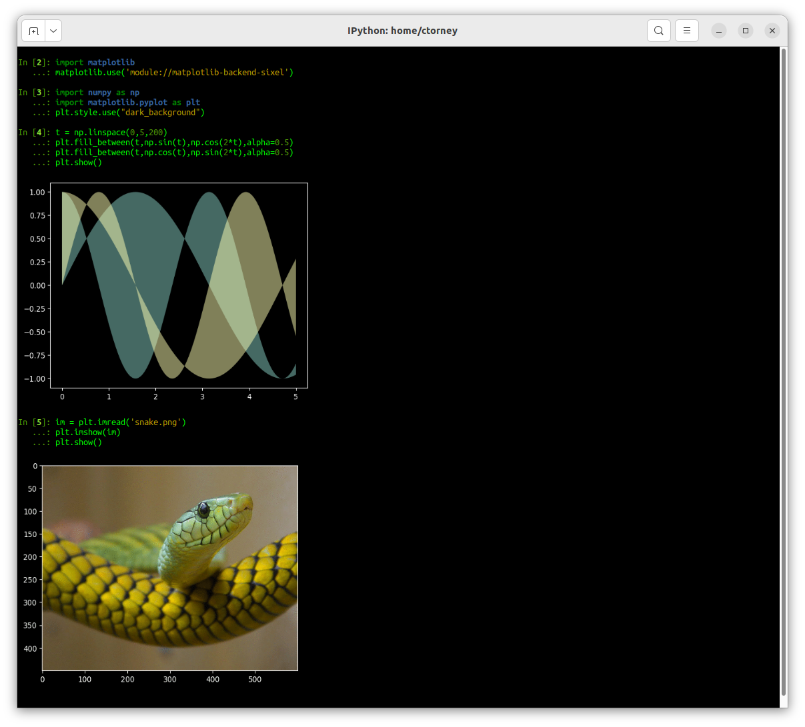

# matplotlib-backend-sixel

This python module allows you to use your
[sixel-enabled terminal](https://www.arewesixelyet.com/)
to show inline plots generated by python's
[matplotlib](https://github.com/matplotlib/matplotlib).

The module is a modified version of the [kitty backend](https://github.com/jktr/matplotlib-backend-kitty) and is also based on this 
earlier [sixel backend](https://github.com/jonathf/matplotlib-sixel).

You will need a terminal that has support for the SIXEL graphics format and [imagemagick](https://imagemagick.org/index.php) installed. 

To install either run

 - `$ pip install --user matplotlib-backend-sixel`

or clone this repo and run
 - `$ cd matplotlib-backend-sixel && pip install . `

Configure matplotlib to use the module by either setting the
environment variable `MPLBACKEND` to `module://matplotlib-backend-sixel`
or by initializing matplotlib as follows.

```python
import matplotlib
matplotlib.use('module://matplotlib-backend-sixel')
import matplotlib.pyplot as plt
```

If you've installed this module correctly, you can now use
the following sample code to draw a plot in your terminal.

```
$ ipython
In [1]: import matplotlib
   ...: matplotlib.use('module://matplotlib-backend-sixel')
   ...: import numpy as np
   ...: import matplotlib.pyplot as plt
   ...: plt.style.use("dark_background")
   ...: t = np.linspace(0,5,200)
   ...: plt.fill_between(t,np.sin(t),np.cos(2*t),alpha=0.5)
   ...: plt.fill_between(t,np.cos(t),np.sin(2*t),alpha=0.5)
   ...: plt.show()

<plot is shown>
```
Example output using Gnome terminal [compiled with SIXEL support](https://github.com/mate-desktop/mate-terminal/issues/410)



If you set your matplotlib to interactive mode via
`matplotlib.pyplot.ion()` or by running python as
`python -i`, non-empty figures are drawn on construction
where possible. This allows you to use pandas' `plot()`
calls directly, without calling `plt.show()`, and still
enables you to manually construct and `plt.show()`.

If your matplotlib is in non-interactive mode,
you can construct your figures as usual, and then call
`plt.show()` to render them to your terminal. This
works from both a repl and when running scripts.

Internally, this backend is somewhat based on matplotlib's
IPython support: it's a hybrid of image and GUI backend types.
It works by using matplotlib's `Agg` backend to render the
plot, and then calls `imagemagick` to convert to sixel format 
and then cat the image to your terminal. This means that plotting works as
expected, but the image drawn to your terminal isn't
interactive and animations aren't supported.
